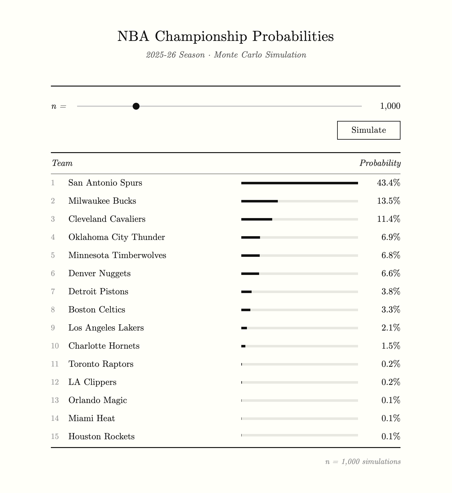

# NBA Distributed Season Simulator

I've been a basketball fan my whole life. After watching this season's playoffs I kept thinking about one question: can you actually predict who wins the championship through probability? Not a gut feeling, not a power ranking, but real math based on how teams actually play.

So I built this. It pulls real 2025-26 NBA player and team stats, simulates the entire season and playoffs, and runs that simulation thousands of times to compute championship probabilities.

```
San Antonio Spurs:      40.3%
Milwaukee Bucks:        13.0%
Cleveland Cavaliers:    13.0%
Oklahoma City Thunder:   8.5%
```

---

## Dashboard



---

## How it works

The core idea is Monte Carlo simulation. Instead of trying to solve the math directly, you just run the season over and over and count what happens.

Run the season 1000 times. Count who wins the championship most often. That percentage is your probability.

The randomness is what makes it interesting. Each game is different because each shot, each possession, each turnover is decided by a weighted random number based on real player stats. Shai making 52% of his shots means any random number below 0.52 is a make. 52% of all numbers between 0 and 1 fall below 0.52, so he makes it at the right rate naturally.

Both of these are equivalent:

```python
random.random() < 0.52  # makes it
random.random() < 0.48  # misses it
```

Run it enough times and the law of large numbers takes care of the rest.

---

## What goes into each possession

This is where it gets interesting. A lot of simulators just use team-level averages. I wanted something more realistic, so each possession accounts for:

**Who gets the ball**

Every player has a usage rate — the percentage of team possessions they use while on the court. I weight player selection by usage rate, so Shai touches the ball way more often than a bench player. Shaq's three point attempt rate is basically 0%. Steph's is around 50%. The simulation reflects that.

**Turnovers**

Each player has a real turnover probability per possession:

```
possessions with ball = 100 x (minutes per game / 48) x usage rate
turnover probability  = turnovers per game / possessions with ball
```

For Shai (2 turnovers, 34 minutes, 32% usage):
```
possessions = 100 x (34/48) x 0.32 = 22.7
turnover probability = 2 / 22.7 = 8.8%
```

**Fouls**

Each player has a real foul rate based on their free throw attempts:

```
foul rate = free throw attempts per game / (field goal attempts per game x 2)
```

Shai draws a ton of fouls. A bench player who never gets to the line barely ever gets fouled. That difference shows up in the simulation.

**Defense**

Every team has a defensive rating (points allowed per 100 possessions). The Thunder at 106.5 are elite. A bad defense might be 118+. I use this to adjust shooting percentages every possession:

```
defensive modifier = opponent defensive rating / league average (114.7)

vs Thunder: 106.5 / 114.7 = 0.928 → shooting % drops 7%
vs bad defense: 118 / 114.7 = 1.03 → shooting % bumps up slightly
```

**Offense**

Same idea on the other side. Teams with high offensive ratings get a boost. This helps balanced teams like the Knicks who don't have one dominant star but have a great system.

**Home court**

Home teams win roughly 60% of games. I model this as a 1% boost to the home team's final score. Simple but it adds up across 1230 games.

---

## The distributed part

Running 1000 full season simulations sequentially takes 26 minutes on a single process. That's too slow to be useful.

The fix is Celery and Redis. Celery is a distributed task queue. Redis is the message broker that sits between you and the workers. You dispatch 1000 jobs, Redis holds them in a queue, and 10 workers pull from that queue simultaneously.

```
You dispatch 1000 jobs
        |
        v
Redis holds the job queue
        |
        v
10 workers pull jobs simultaneously
        |
        v
Each worker runs one full season simulation
        |
        v
Results saved to PostgreSQL
```

One problem: each worker was calling the NBA API to fetch player and team data. With 10 workers running at once that's 330 simultaneous API calls. The NBA API blocks you immediately. The fix was to fetch the data once, serialize it to JSON, and cache it in Redis. Every worker reads from Redis instead of hitting the API.

Result: 1000 simulations in 7 minutes instead of 26. 3.7x speedup.

---

## Benchmark

| Method | Time |
|---|---|
| Sequential (1 process) | 1559 seconds (26 minutes) |
| Distributed (10 workers) | 419 seconds (7 minutes) |
| Speedup | 3.7x |

Theoretical max with 10 workers is 10x. Real world is lower because of Redis overhead, job dispatch time, and Postgres write contention across concurrent workers.

---

## Data structure

Season data is keyed by team ID:

```python
{
    1610612760: {
        'team_name': 'Oklahoma City Thunder',
        'off_rating': 117.6,
        'def_rating': 106.5,
        'pace': 100.37,
        'roster': [
            {
                'player_id': 1628983,
                'name': 'Shai Gilgeous-Alexander',
                'fg_pct': 0.519,
                'fg3_pct': 0.375,
                'ft_pct': 0.898,
                'usg_pct': 0.318,
                'min_pg': 34.2,
                'pts_pg': 31.1,
                'tov_pg': 2.4,
                'fga_pg': 17.8,
                'fg3a_pg': 5.3,
                'fta_pg': 8.1
            },
        ]
    },
}
```

Player IDs are used as keys instead of names because two NBA players can share the same name.

---

## Why the real schedule

I pull the actual 2025-26 NBA schedule from the API instead of generating a fake one. Home and away assignments are accurate, back to backs are real. Regular season game IDs start with 0022, playoff game IDs start with 0042. Filtering to 0022 gives exactly 1230 games.

---

## Playoff format

16 teams, 8 per conference, seeded by simulated regular season wins. Each round is best of 7.

```
Round 1:  1v8, 2v7, 3v6, 4v5
Round 2:  winners bracket
Round 3:  conference finals
Round 4:  NBA Finals
```

---

## Known limitations

**No injury modeling.** Every player plays every game at their season average. The 2025-26 Bucks finished 11th in the East because Lillard got hurt early. The simulator doesn't know that and rates them too high.

**No passing.** Every possession ends with the player who was selected. In reality players pass and create shots for others.

**No real rotations.** Players are selected from the full roster weighted by usage rate, not actual 5-man lineups.

**Star player bias.** Individual stats are weighted heavily. Teams with one elite player like Wemby tend to be overrated relative to deep, balanced rosters.

These are all V2 problems.

---

## V2 plan

V1 uses current season stats. V2 adds a stat projection layer. You pick a future season, the system pulls 2-3 seasons of historical data per player, runs an ML model with age curves to project stats forward, and feeds those projections into the same simulator. The simulation engine stays the same. Only the data layer changes.

---

## Tech stack

| Layer | Tool |
|---|---|
| Data source | nba_api |
| Cache | Redis |
| Task queue | Celery |
| Message broker | Redis |
| Database | PostgreSQL |
| API | FastAPI |
| Frontend | HTML |

---

## Project structure

```
distributed-nba-season-simulator/
├── app/
│   ├── simulation/
│   │   ├── data_fetcher.py      # pulls and caches NBA stats from nba_api
│   │   ├── game_simulator.py    # possession engine, game simulation, series simulation
│   │   └── season_simulator.py  # full season, standings, playoff bracket
│   ├── workers/
│   │   └── tasks.py             # Celery task definition
│   ├── database/
│   │   └── database.py          # Postgres connection, table setup, read/write
│   └── api/
│       └── api.py               # FastAPI endpoint
├── assets/
│   └── dashboard.png
├── frontend/
│   └── index.html               # results dashboard
└── README.md
```
---
## How to run

```bash
python3 -m venv venv
source venv/bin/activate
pip install nba_api celery redis psycopg2-binary fastapi uvicorn pandas
```

```bash
psql postgres -c "CREATE DATABASE nba_sim;"
python3 -c "from app.database.database import create_table; create_table()"
```

```bash
# fetch and cache season data once
python3 -c "from app.simulation.data_fetcher import cache_data; cache_data('2025-26')"
```

```bash
# start Redis
brew services start redis

# start workers
celery -A app.workers.tasks worker --loglevel=info

# run simulations
python3 -c "
from celery import group
from app.workers.tasks import run_simulation
job_group = group(run_simulation.s('2025-26') for i in range(1000))
job_group.apply_async().get()
"

# start API
uvicorn app.api.api:app --reload
```

Open `http://localhost:8000/probabilities?season=2025-26` in a browser.


